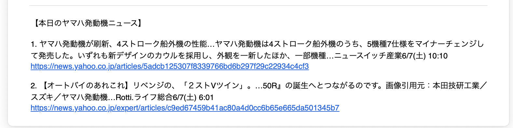

# Yamaha News Notifier

## 📌 プロジェクト概要

ヤマハ発動機に関する最新ニュースをYahoo!ニュースから取得し、メールで自動通知するPythonスクリプトです。

---

## 🔍 詳細説明（SEO対応）

**Yamaha News Notifier**は、ヤマハ発動機に関する最新情報を効率よく収集・通知するための自動化ツールです。  
以下のような方におすすめです：

- ヤマハ発動機の株式に投資している方  
- 業界リサーチを行っているマーケターやアナリスト  
- ニュースを定期的にチェックしたい企業関係者

### ✅ 主な機能

- Yahoo!ニュースで「ヤマハ発動機」を検索し、当日付の記事のみを抽出  
- 記事のタイトルとURLを重複なく取得し、CSVに保存  
- Gmailを使って、該当記事の一覧または「記事なし」の通知を送信  
- cronなどと組み合わせれば、完全自動化が可能

PythonとSelenium、BeautifulSoup、pandas、smtplibを活用した実用的な自動化プロジェクトです。

---

## 🖼️ 実行結果
メール通知イメージ

